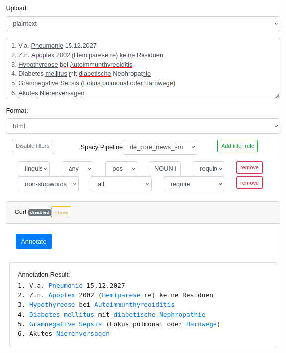

# DrNote

**Accepted at PLOS DH**:  
[https://journals.plos.org/digitalhealth/article?id=10.1371/journal.pdig.0000086](https://journals.plos.org/digitalhealth/article?id=10.1371/journal.pdig.0000086) (or see citation)

The DrNote annotation tool features a simple yet effective annotation tool for various purposes.  

The annotation method is based on the [Opentapioca](https://arxiv.org/abs/1904.09131) [(GitHub)](https://github.com/wetneb/opentapioca) codebase to provide a named entity linking functionality on unstructured text data.

The project leverages the data from Wikidata and Wikipedia without the requirement of any commercial components.  

The annotation service provides a web-based UI as well as an API-based access.  

The processing of PDF files is supported. Linked entities can be injected as hyperlinks into the uploaded PDF file.  

Different languages (de, en, es etc.) are supported.

**Demo**:  
Our demo instance is available at:  
[https://drnote.misit-augsburg.de](https://drnote.misit-augsburg.de)  
*Note:* Upload of large PDF files is not supported. Uploaded data is discarded after processing.  

**Graphical Demo**:  
<kbd><kbd>  

**CLI Demo**:
<details>

```bash
# Enter text
text="Die Diagnosen sind Hypothyreose bei Autoimmunthyreoiditis, Diabetes mellitus mit diabetische Nephropathie und akutes Nierenversagen."
# Annotate
curl -k https://drnote.misit-augsburg.de/annotate \
  -F "inputType=plaintext" \
  -F "outputType=html" \
  -F \
"filterOptions={
  \"pipeline\": \"de_core_news_sm\",
  \"rules\": [
    \"any pos[NOUN,PROPN] require\",
    \"all non_stopwords require\"
  ]
}" \
  -F \
"plaintext=$text"
```
</details>

## How to Use
### Spawn DrNote using Pre-trained Data
Steps to spawn the service using pre-trained data:
```bash
# Assumed: Docker, Docker-compose installed and user added to Docker group
# follow guide from https://docs.docker.com/engine/install/ubuntu/
# sudo apt-get install -y docker docker-compose
# sudo usermod -aG docker $USER

# Clone repository
git clone https://github.com/frankkramer-lab/DrNote
cd DrNote/

# Retrieve pre-trained data
wget -O build/pretrained_data.tar.gz https://myweb.rz.uni-augsburg.de/~freijoha/DrNote/pretrained_data.tar.gz

# Spawn annotation service
./04_start_annotation_service.sh
```

The annotation service should be available at:  
`https://<DOCKER_HOST>/`

### Build From Scratch and Spawn DrNote
Steps to automatically build the OpenTapioca data setup pipeline and spawn the annotation service.  

Prestep: Setup the configuration:
  * Modify the file `./cfg/opentapioca_profile.json`.
  * Modify the file `./cfg/load_config.json`.  
    **Note:** The language code should match  the entry in `./cfg/opentapioca_profile.json`.

Steps:
1. Check dependencies:
   * Run `./01_checkDependencies.sh`

2. Generate the NIF file:
   * Run `./02_loadNIFFile.sh`

3. Generate the OpenTapioca data:
   * Run `./03_processForOpenTapioca.sh`

4. Spawn the MISIT annotation service:
   * Run `./04_start_annotation_service.sh`

The annotation service should be available at:  
`https://<DOCKER_HOST>/`

## Citation
The paper is available at: [https://journals.plos.org/digitalhealth/article?id=10.1371/journal.pdig.0000086](https://journals.plos.org/digitalhealth/article?id=10.1371/journal.pdig.0000086)
If you use our work or want to reference it, use the following bibtex lines:
```
@article{10.1371/journal.pdig.0000086,
    doi = {10.1371/journal.pdig.0000086},
    author = {Frei, Johann and Soto-Rey, Iñaki and Kramer, Frank},
    journal = {PLOS Digital Health},
    publisher = {Public Library of Science},
    title = {DrNote: An open medical annotation service},
    year = {2022},
    month = {08},
    volume = {1},
    url = {https://doi.org/10.1371/journal.pdig.0000086},
    pages = {1-18},
    abstract = {In the context of clinical trials and medical research medical text mining can provide broader insights for various research scenarios by tapping additional text data sources and extracting relevant information that is often exclusively present in unstructured fashion. Although various works for data like electronic health reports are available for English texts, only limited work on tools for non-English text resources has been published that offers immediate practicality in terms of flexibility and initial setup. We introduce DrNote, an open source text annotation service for medical text processing. Our work provides an entire annotation pipeline with its focus on a fast yet effective and easy to use software implementation. Further, the software allows its users to define a custom annotation scope by filtering only for relevant entities that should be included in its knowledge base. The approach is based on OpenTapioca and combines the publicly available datasets from WikiData and Wikipedia, and thus, performs entity linking tasks. In contrast to other related work our service can easily be built upon any language-specific Wikipedia dataset in order to be trained on a specific target language. We provide a public demo instance of our DrNote annotation service at https://drnote.misit-augsburg.de/.},
    number = {8},
}
```

## Referenced Repositories
 - [Annotation Service](https://git.rz.uni-augsburg.de/freijoha/annotation-service) provides the Webservice for a given PDF/Text.
 - [Annotation NIF Generation](https://git.rz.uni-augsburg.de/freijoha/annotation-nif-generation) extracts a NIF-compatible file from Wikipedia.
 - [OpenTapioca Wrapper](https://git.rz.uni-augsburg.de/freijoha/opentapioca) wraps the OpenTapioca build/preprocessing/training pipeline (including Solr). 
 - [PDF Processing Library](https://git.rz.uni-augsburg.de/freijoha/pdf-link2doc) implements the PDF Text extraction and link editing functionality.

 Not required for smaller queries:
 - [WikiData Query Instance Wrapper](https://git.rz.uni-augsburg.de/freijoha/wikidata-query-service)
